# Theatre API

Theatre API is a RESTful API for managing theatre performances, reservations, and ticket sales. It provides endpoints for managing plays, performances, theatre halls, genres, actors, and user reservations.

---

## Features

- **Theatre Halls:** Manage theatre halls with rows and seats per row.
- **Plays & Genres:** Organize plays with associated genres and actors.
- **Performances:** Schedule performances in specific halls with show times.
- **Reservations:** Create reservations and issue tickets for performances.
- **User Authentication:** Secure user management with token-based authentication.

---
## DB structure:
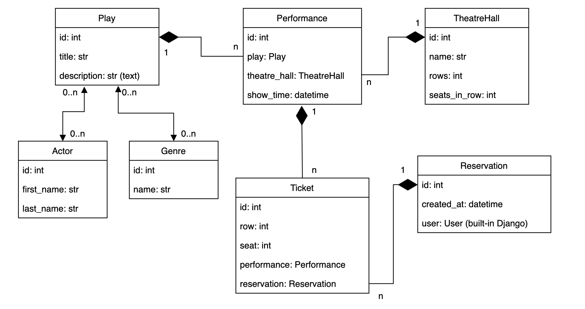

---
## Technologies

- Python 3.11
- Django 4.x
- Django REST Framework (DRF)
- PostgreSQL
- Docker & Docker Compose

---

## Getting Started

### Clone the Repository

```bash
git clone git@github.com:arsen-arutiunov/theatre-api.git
```

## Prerequisites
### Make sure you have the following installed:

- 	Python 3.11
- Docker & Docker Compose

## Setup & Run with Docker
### 1. Environment Variables

The project uses environment variables for sensitive data. Below are the required variables:
- SECRET_KEY: secret key for django app
- DEBUG: debug-mode (default: True)
- DB_NAME: PostgreSQL database name
- USER: PostgreSQL username
- PASSWORD: PostgreSQL password
- HOST: Database host (default: db)
- PORT: Database port (default: 5432)

### Create a .env file in the project root:
```aiignore
SECRET_KEY=<secret_key>
DEBUG=True
DB_NAME=theatre
DB_USER=theatre_user
DB_PASSWORD=secure_password
DB_HOST=db
DB_PORT=5432
```
### 2.	Creating and making migrations:
```bash
python manage.py makemigrations
python manage.py migrate
```
### 3.	Build and start the services:
```bash
docker-compose up --build
```
### 4.	View the application name (in the `NAMES` column):
```bash
docker ps
```
### 5.	Create a superuser:
```bash
docker-compose exec <application name> python manage.py createsuperuser
```
### 6.	Add `test_data.json` to docker:
```bash
docker cp test_data.json <application name>:/app/data.json
```
### 7.	Execute the command to load data into the database:
```bash
docker-compose exec <application name> python manage.py loaddata data.json
```
### 8. Access the application:
- API: http://localhost:8001/api/theatre/
- Admin Panel: http://localhost:8001/admin/

---
## API Endpoints

### The Theatre API provides the following endpoints:
| Endpoint                                    | Description                              |
|--------------------------------------------|------------------------------------------|
| **GET** /api/theatre/actors/               | Get the cast list                        |
| **POST** /api/theatre/actors/              | Create a new actor                       |
| **GET** /api/theatre/genres/               | Get a list of genres                     |
| **POST** /api/theatre/genres/              | Create a new genre                       |
| **GET** /api/theatre/performances/         | Get a list of performances               |
| **POST** /api/theatre/performances/        | Create a new performance                 |
| **GET** /api/theatre/performances/{id}/    | Get a performance by ID                  |
| **PUT** /api/theatre/performances/{id}/    | Update a performance by ID               |
| **PATCH** /api/theatre/performances/{id}/  | Partially update a performance by ID     |
| **DELETE** /api/theatre/performances/{id}/ | Delete a performance by ID               |
| **GET** /api/theatre/plays/                | Get a list of plays                      |
| **POST** /api/theatre/plays/               | Create a new play                        |
| **GET** /api/theatre/plays/{id}/           | Get a play by ID                         |
| **PUT** /api/theatre/plays/{id}/           | Update a play by ID                      |
| **PATCH** /api/theatre/plays/{id}/         | Partially update a play by ID            |
| **POST** /api/theatre/plays/{id}/upload-image/ | Upload an image for a play             |
| **GET** /api/theatre/reservations/         | Get a list of reservations               |
| **POST** /api/theatre/reservations/        | Create a new reservation                 |
| **GET** /api/theatre/theatre_halls/        | Get a list of theatre venues             |
| **POST** /api/theatre/theatre_halls/       | Create a new theatre room                |
### User Endpoints:
| Endpoint                         | Description                              |
|-----------------------------------|------------------------------------------|
| **GET** /api/user/me/            | Retrieve current user's profile          |
| **PUT** /api/user/me/            | Update current user's profile            |
| **PATCH** /api/user/me/          | Partially update current user's profile  |
| **POST** /api/user/register/     | Create a new user                        |
| **POST** /api/user/token/        | Obtain authentication token              |
| **POST** /api/user/token/refresh/| Refresh the authentication token         |
| **POST** /api/user/token/verify/ | Verify the authentication token          |
---
### Refer to the OpenAPI schema for a detailed list of endpoints:
- http://localhost:8001/api/schema/


---
## Pages images:
### Api root page 
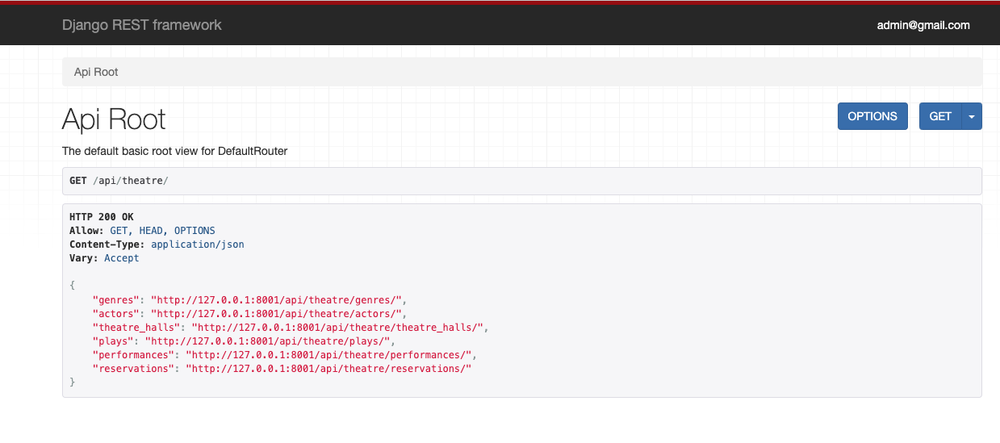

### Actor list
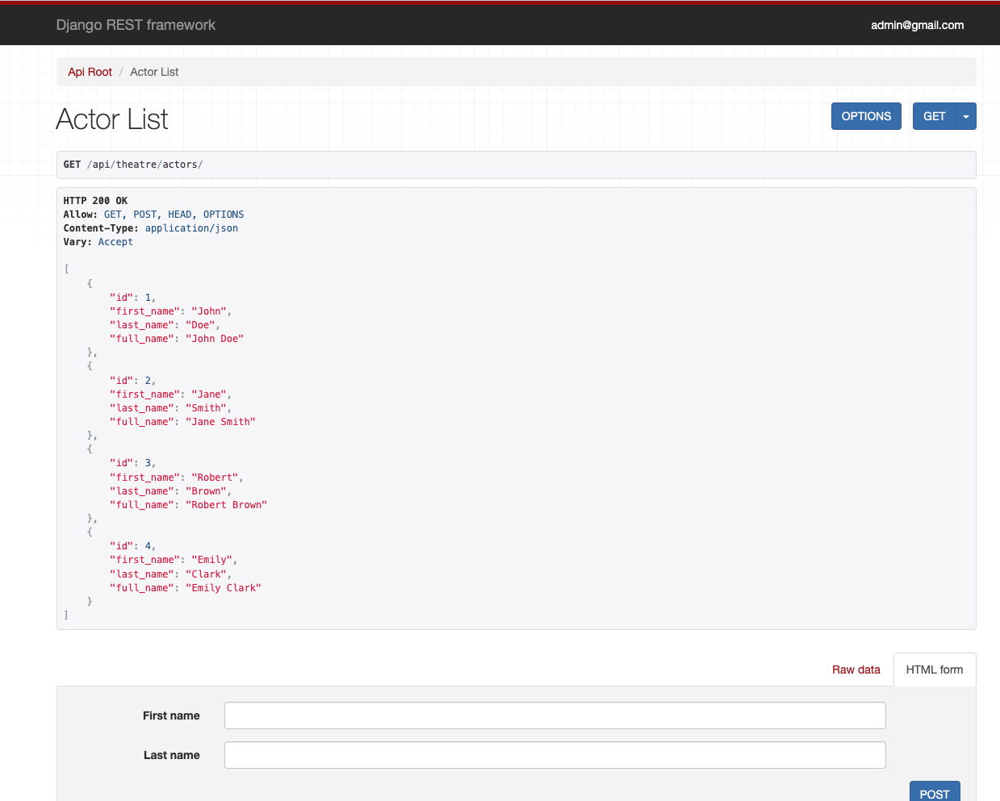

### Genre list 
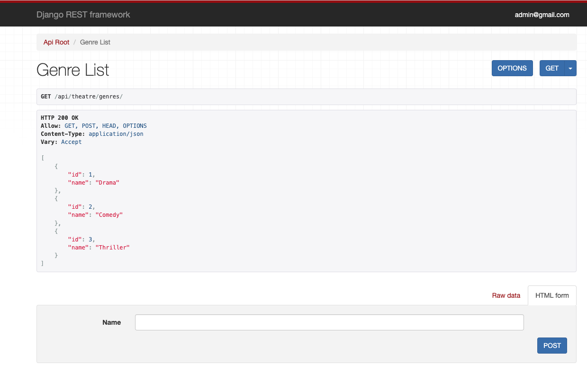

### Play list 
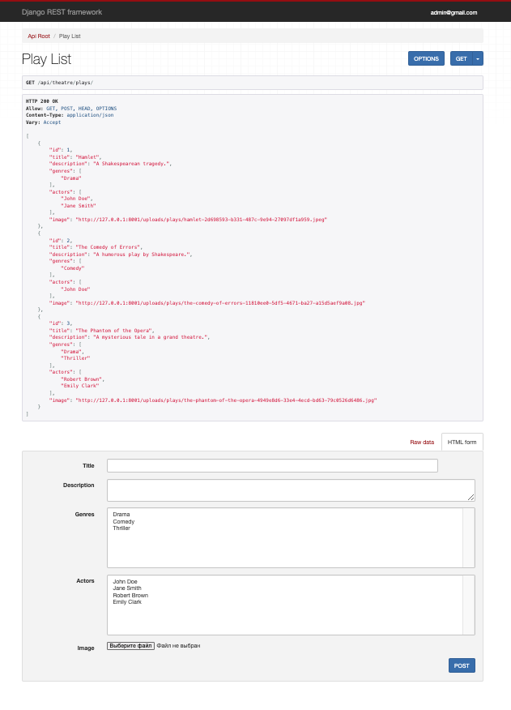

### Theatre Hall list 
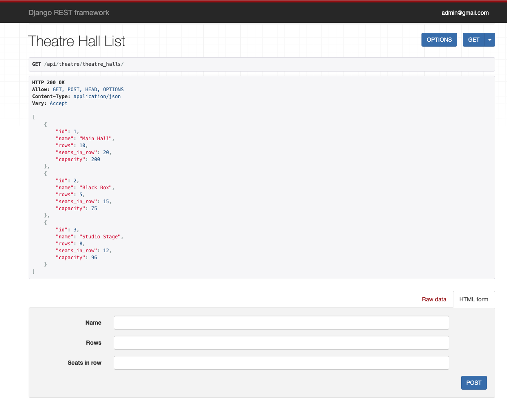

### Performance list 
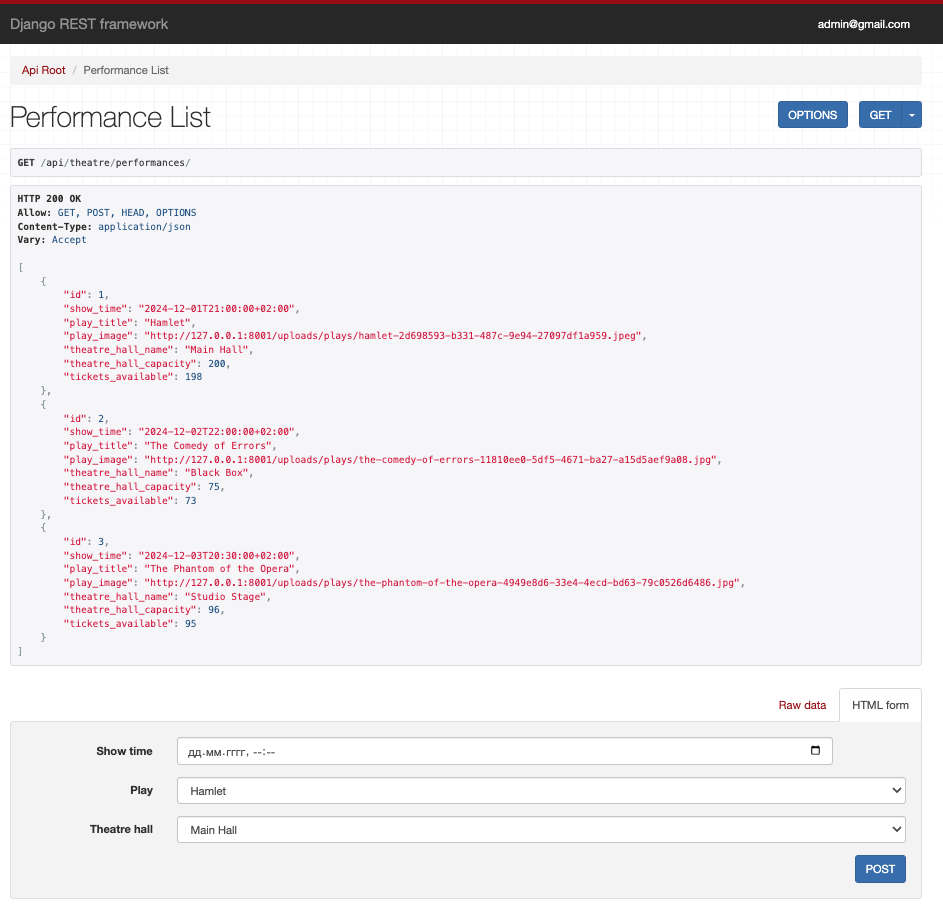

### Reservation list 
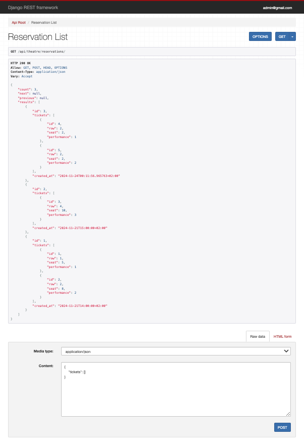

### Create user 
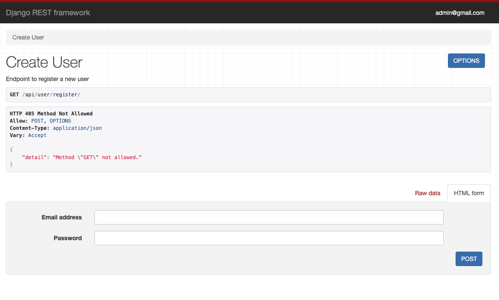

### Manage user 
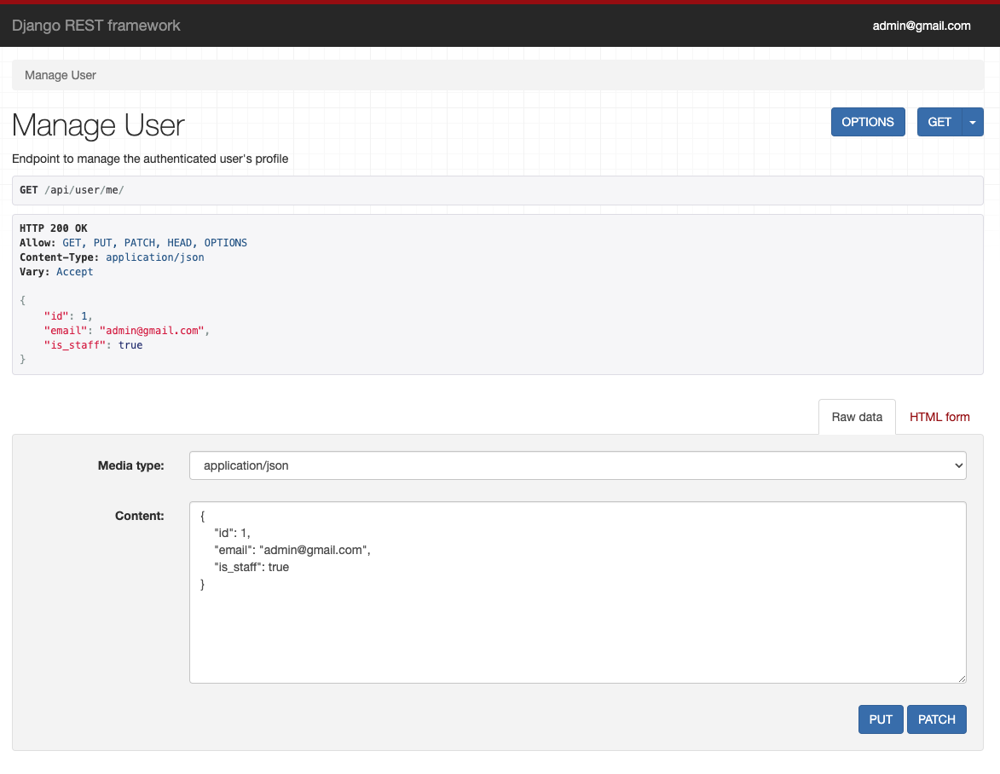

### Token obtain 
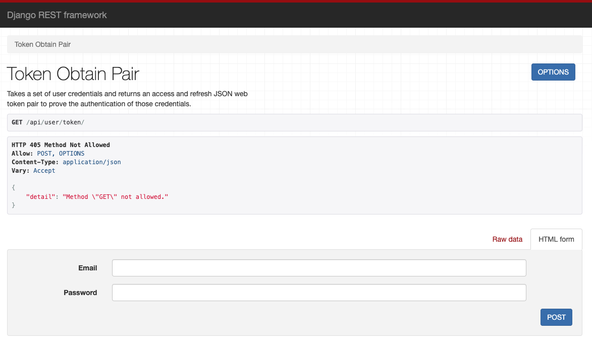

### Swagger page 
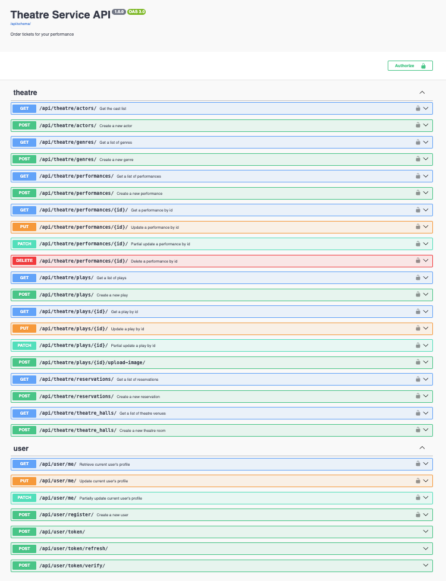

---
### Project Structure:
```aiignore
theatre-api/
├── theatre/               # Core app for theatre management
├── TheatreApi             # Main app for project management
├── users/                 # User authentication and management
├── data.json              # Sample data for initial setup
├── Dockerfile             # Docker configuration
├── docker-compose.yml     # Docker Compose setup
└── README.md              # Project documentation
```
---
## Contact

### For questions or feedback, feel free to reach out:
- Author: [Arsen Arutiunov](https://www.linkedin.com/in/arsen-arutiunov-3ba190114/)
- Email: [arsen.test.mess@gmail.com]()
- GitHub: [arsen-arutiunov](https://github.com/arsen-arutiunov)
